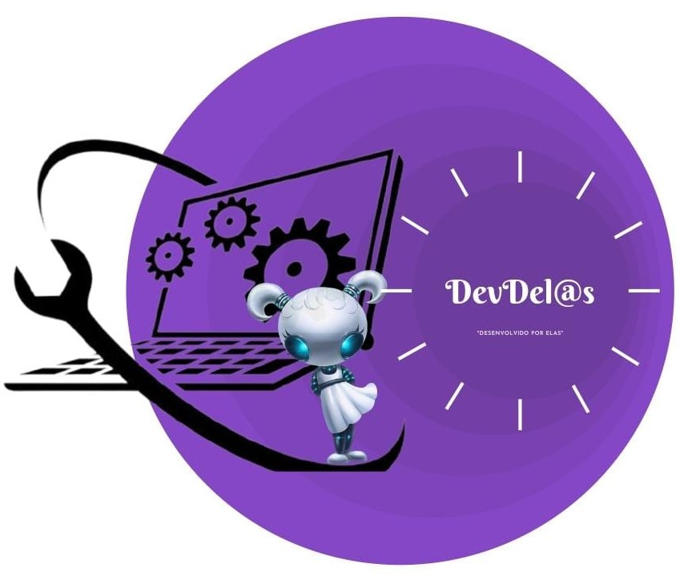

# Desafio Final Plataforma-dindin

Nesse projeto construimos um site estático "A plataforma Dindin", com a finalidade realizar o desafio
final do programa Formação pra.elas, promovido pelo Banco BV em parceiria com o gama Academy.

## Objetivo da equipe 

Somos o Squard dev.Del@s, mulheres de coragem e inciantes no mundo da tecnologio, nosso objetivo 
é mostrar a pontencialidade de dos projetos desenvolvidos_por_elas mostrando a força e a garra feminina.
        
## Contribuidoras

* Flaviane Souza Santos
* Gabriele Cristina Cerdas
* Grazielle Meneses
* Monique Rene N Lins de Azevedo


```

